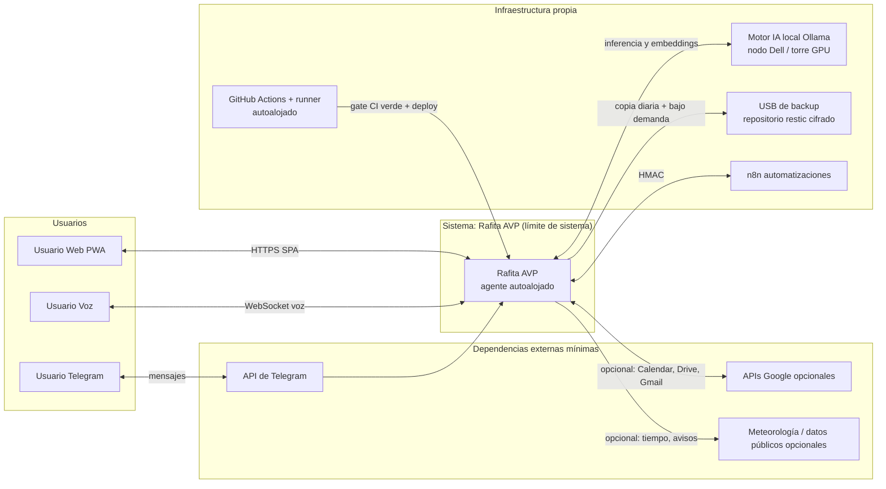
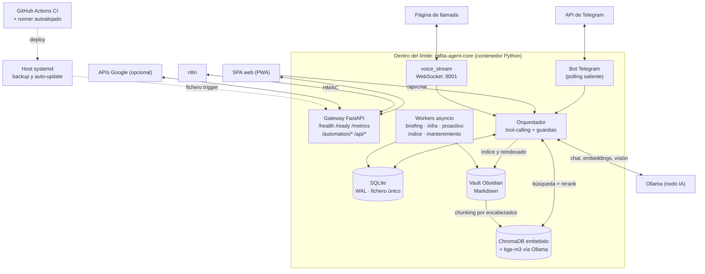
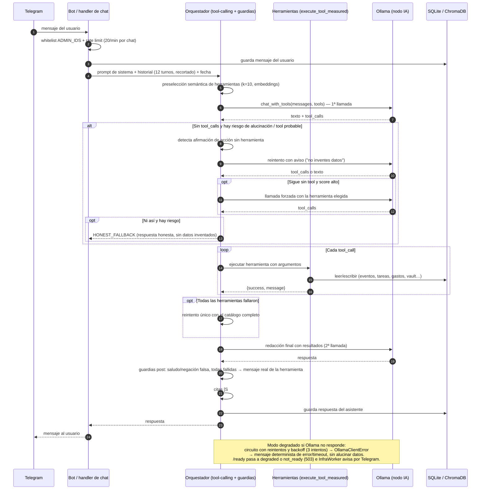

# Arquitectura — Rafita AVP

Documento de arquitectura en formato **C4 ligero** (Contexto → Contenedores →
flujos). Todo lo que se afirma aquí está verificado en el código del repositorio;
lo que no pudo verificarse se marca explícitamente.

- Fuente principal: `agent/src/main.py` (ensamblado), `agent/src/core/orchestrator.py`,
  `agent/src/utils/webhook_server.py`, `agent/src/utils/vector_manager.py`,
  `agent/src/database.py`, `docker-compose.yml`, `.github/workflows/`.
- Decisiones estructurales: [ADR-001](adr/001-vector-store.md) (ChromaDB),
  [ADR-002](adr/002-task-queue.md) (sin cola externa), [ADR-003](adr/003-model-selection.md)
  (modelos), [ADR-004](adr/004-two-node-deployment.md) (dos nodos),
  [ADR-005](adr/005-sqlite.md) (SQLite), [ADR-006](adr/006-file-trigger-backup.md) (backup por trigger).
- Modelo de amenazas asociado: [threat-model.md](threat-model.md).

---

## 1. Contexto (nivel 1)

**Rafita AVP** es un asistente virtual privado, autoalojado y monousuario. Convierte
un vault de Obsidian en un segundo cerebro buscable (RAG) y atiende por **Telegram**,
**web (SPA/PWA)** y **voz (notas de voz y llamada en tiempo real)**, con el mismo
cerebro en los tres canales.

### Actores

| Actor | Rol | Interacción verificada |
|---|---|---|
| Usuario por Telegram | Cliente primario | El bot hace **polling saliente** a la API de Telegram (`getUpdates` en `bot.py`); no hay webhook entrante desde Telegram |
| Usuario por web | Cliente SPA/PWA | Login email+contraseña (JWT HS256, `utils/web_auth.py`) u opcionalmente Google; API bajo `Authorization: Bearer` (`utils/web_api.py`) |
| Usuario por voz | Nota de voz / llamada | Servidor WebSocket en el puerto 8001 (`voice_stream/server.py`), con token de llamada |
| Motor de IA local (Ollama) | Inferencia y embeddings | Cliente HTTP hacia `OLLAMA_HOST` (nodo Dell o torre con GPU); interfaz `AIProvider` con backend alternativo compatible con OpenAI (`ai/factory.py`) |
| APIs de Google (opcionales) | Calendar, Drive, Gmail, Tasks, Contactos, Fitness | OAuth/cuenta de servicio; el producto funciona sin ellas (modo local: BD + bóveda) |
| API de Telegram | Mensajería | `api.telegram.org` (salida) |
| USB de backup + restic | Copias de seguridad | `deploy/hp/backup/*`; repositorio restic cifrado |
| n8n | Automatizaciones | Llama al gateway con firma HMAC (`X-Webhook-Signature`); el agente lanza flujos por webhook `manual-*` con catálogo y permisos (`core/orchestration.py`) |
| GitHub Actions (CI) + runner autoalojado | Puerta de calidad y despliegue | `ci.yml` (gate) y `deploy-hp.yml` (`runs-on: self-hosted`) |
| Hardware (HP / Dell / torre) | Nodo de aplicación, nodo de IA y GPU opcional | Topología de dos nodos (ADR-004) + despliegues en `deploy/hp`, `deploy/dell`, `deploy/tower` |

### Límites del sistema

- **Sin nube de producto**: no hay backend propio en internet, ni telemetría, ni
  cuentas multi-tenant. Cada instalación es independiente.
- **Salidas a internet mínimas y opcionales**, verificadas en `agent/src`:
  `api.telegram.org` (imprescindible para el bot), `googleapis.com` /
  `accounts.google.com` (si se conecta Google), más salidas dependientes de
  funciones concretas: `api.open-meteo.com` (tiempo del briefing),
  `opendata.aemet.es` (avisos, requiere API key), `huggingface.co` y
  `github.com` (descarga de voces TTS/modelos), DuckDuckGo y GitHub/RSS
  (búsqueda web y radar de IA), y `api.openai.com` **solo** si
  `AI_PROVIDER=openai` (por defecto es `ollama`).
- **Puertos de servicio solo en localhost**: `docker-compose.yml` publica
  `127.0.0.1:8000` (gateway) y `127.0.0.1:8001` (voz); el overlay HP mueve el
  gateway a `8010`. El acceso externo se hace con proxy o `tailscale serve`
  (HTTPS), no exponiendo servicios a internet.
- **Fuerza de trabajo del LLM remota pero en red privada**: el nodo de
  inferencia no almacena datos de usuario (ADR-004).



---

## 2. Contenedores (nivel 2)

| Contenedor / pieza | Tecnología | Responsabilidad | Evidencia |
|---|---|---|---|
| `rafita-agent-core` | Python 3.11 + FastAPI + python-telegram-client | Proceso único que aloja: bot Telegram, gateway, servidor de voz, orquestador y workers | `agent/src/main.py`, `Dockerfile` |
| ├ Bot Telegram | polling saliente | Comandos, chat, callbacks; whitelist y rate limit | `agent/src/bot.py`, `handlers/*` |
| ├ Gateway FastAPI (`webhook_server`) | puerto 8000 (8010 en HP) | `/health`, `/ready`, `/metrics`, webhooks de n8n (`/automation/*`), integraciones, y router `/api/*` de la SPA | `utils/webhook_server.py`, `utils/web_api.py` |
| ├ Servidor de voz (`voice_stream`) | WebSocket, puerto 8001 | STT/TTS de la llamada, VAD, frases de espera | `voice_stream/server.py` |
| ├ Orquestador | `core/orchestrator.py` | Prompt de sistema, preselección de herramientas, tool-calling, guardias de honestidad, citas | `core/orchestrator.py`, `handlers/chat_tools.py` |
| └ Workers en proceso | asyncio | `BriefingWorker`, `InfraWorker`, `ProactiveWorker`, `BrainMaintainer`, `VaultIndexer` | `main.py`, `utils/proactive_briefing.py`, `utils/infra_monitor.py`, `utils/brain_maintainer.py`, `utils/vault_indexer.py` |
| SQLite | `aiosqlite`, fichero único | Memoria: chat, eventos, tareas, alertas, finanzas, usuarios web, credenciales cifradas, automatizaciones | `agent/src/database.py` ([ADR-005](adr/005-sqlite.md)) |
| ChromaDB embebido | `chromadb.PersistentClient` | Índice vectorial del vault + búsqueda con reranking híbrido | `utils/vector_manager.py` ([ADR-001](adr/001-vector-store.md)) |
| Embeddings (`bge-m3`) | Ollama | `OllamaEmbeddingFunction` con caché; dimensión configurable | `utils/vector_manager.py`, `config.py` |
| Vault Obsidian | Markdown en disco | Segundo cerebro, frontmatter y taxonomía; watcher con debounce | `utils/vault_indexer.py`, `vault_config.py` |
| Cola de tareas | **No existe servicio externo** | ADR-002: asyncio + ejecución en el propio proceso; el estado de las automatizaciones se persiste en `automation_runs` | `docs/adr/002-task-queue.md`, `database.py` |
| Ollama (nodo Dell / torre) | Servicio de inferencia | Chat, visión y embeddings; red privada, sin datos de usuario | `docker-compose.yml`, `deploy/dell`, `deploy/tower`, ADR-004 |
| n8n | Contenedor propio | 10 flujos (briefing, inbox, sync, radar, CRM…), firmados con HMAC | `n8n/README.md`, `deploy/hp/docker-compose.n8n.yml` |
| Backup (host) | systemd + restic | Timer diario, copia horaria de BD, restore-drill, trigger por fichero | `deploy/hp/backup/` ([ADR-006](adr/006-file-trigger-backup.md)) |
| CI / CD | GitHub Actions | `ci.yml` = gate (lint, mypy, tests, pip-audit, gitleaks, build); `deploy-hp.yml` = `workflow_run` con `runs-on: self-hosted` | `.github/workflows/*`, `scripts/auto_update.sh` |



### Niveles de despliegue

- **Docker Compose** (`docker-compose.yml`): dos servicios, `ollama-service` y
  `rafita-agent-core`, en red propia; puertos publicados en `127.0.0.1`.
- **Overlay HP** (`deploy/hp/docker-compose.hp.yml`): sin Ollama local (perfil
  `no-local`), gateway en `8010`, `OLLAMA_HOST` hacia el nodo de IA.
- **CI → CD**: `ci.yml` es la puerta (ruff, mypy, pytest con cobertura ≥90 %,
  `pip-audit`, gitleaks, build de imagen). `deploy-hp.yml` sólo se dispara con
  `workflow_run` del CI en `success` (o `workflow_dispatch`), en un runner
  autoalojado, y ejecuta `scripts/auto_update.sh`.

### Esquema de datos (tablas principales)

Fuente: `agent/src/database.py`. Sólo se recogen las tablas y columnas
principales (el fichero define además `exports`, `app_connectors`,
`voice_sessions`, `email_sequences`/`email_sequence_steps` y sus índices).
**No hay claves foráñas declaradas**: los enlaces son lógicos (`chat_id`,
`user_id`, `sequence_id`), aunque el arranque activa
`PRAGMA foreign_keys=ON` para las que se añadan en el futuro.

```mermaid
erDiagram
    chat_history {
        INTEGER id PK
        INTEGER chat_id
        TEXT role "user|assistant|system"
        TEXT content
        TEXT created_at
    }
    events {
        INTEGER id PK
        INTEGER chat_id
        TEXT title
        TEXT event_datetime
        INTEGER is_active
        TEXT google_event_id
    }
    tasks {
        INTEGER id PK
        INTEGER chat_id
        TEXT title
        TEXT status
        TEXT due
        TEXT source "local|google"
    }
    alerts {
        INTEGER id PK
        INTEGER chat_id
        TEXT message
        TEXT alert_type
        TEXT expires_at
        INTEGER is_read
        TEXT pattern
        TEXT next_run
    }
    finance_records {
        INTEGER id PK
        INTEGER chat_id
        REAL amount
        TEXT category "income|expense|transfer|investment"
        TEXT currency
        TEXT recorded_at
    }
    personal_knowledge {
        INTEGER id PK
        INTEGER chat_id
        TEXT key
        TEXT value
        TEXT category
    }
    credentials {
        INTEGER id PK
        INTEGER chat_id
        TEXT service
        TEXT value_enc "Fernet"
    }
    knowledge_relations {
        INTEGER id PK
        INTEGER chat_id
        TEXT subject
        TEXT predicate
        TEXT object
        TEXT source
    }
    web_users {
        INTEGER id PK
        TEXT email
        TEXT password_hash "scrypt+sal"
        INTEGER is_admin
    }
    meetings {
        INTEGER id PK
        INTEGER user_id
        TEXT title
        TEXT status
        TEXT transcript
        TEXT summary
        TEXT note_path
    }
    automation_runs {
        INTEGER id PK
        TEXT execution_id UK
        TEXT workflow
        TEXT status "ok|error"
        TEXT severity
        TEXT error
    }
    second_brain_log {
        INTEGER id PK
        TEXT query_text
        INTEGER chat_id
        INTEGER chunks_retrieved
        REAL top_relevance
    }
    kv_store {
        TEXT key PK
        TEXT value
        TEXT expires_at
    }

    chat_history   ||--o{ events              : "chat_id"
    chat_history   ||--o{ tasks               : "chat_id"
    chat_history   ||--o{ alerts              : "chat_id"
    chat_history   ||--o{ finance_records     : "chat_id"
    chat_history   ||--o{ personal_knowledge  : "chat_id"
    chat_history   ||--o{ credentials         : "chat_id"
    chat_history   ||--o{ knowledge_relations : "chat_id"
    chat_history   ||--o{ second_brain_log    : "chat_id"
    web_users      ||--o{ meetings            : "user_id"
```



---

## 3. Diagrama de secuencia — una petición de chat

Canales: **Telegram** entra por `handlers/chat.py` (`handle_message` →
`_process_ai_message`); **web** y **voz** entran por
`core/orchestrator.py` (`generate_response` / `generate_response_stream`).
Los tres comparten prompt de sistema (`build_system_prompt`), catálogo de
herramientas y preselección semántica (`select_tools_semantic`); la cadena
completa de guardias de honestidad (reintento, herramienta forzada y
`HONEST_FALLBACK`) vive en el orquestador y se consume desde web y voz.



**Guardias de honestidad verificadas** (`core/orchestrator.py`): detección de
afirmaciones de acción en primera persona sin `tool_calls`, reintento con aviso,
llamada forzada con una sola herramienta si el score de similitud es alto, y
sustitución por `HONEST_FALLBACK` cuando no puede comprobarse la acción. En
Telegram, la segunda llamada de redacción incluye la instrucción explícita de
no afirmar que algo se hizo si la herramienta devolvió error
(`handlers/chat.py`).

---

## 4. Flujo de datos — RAG

```
vault Obsidian (.md con frontmatter)
   │  watcher (watchdog) con debounce de 2 s + backfill inicial + intake de
   │  .pdf/.docx/.txt/.csv (máx. 10 MB)   → utils/vault_indexer.py
   ▼
chunking por encabezados (≈500 tokens, overlap ≈50) → utils/vault_indexer.py
   ▼
embeddings bge-m3 vía Ollama (con caché) → utils/vector_manager.py
   ▼
ChromaDB embebido (data/vector_db/) — colección con flags de tag escalares
   ▼
consulta: sobrrecuperación (max(top_k*4, 20)) → reranking híbrido
   (semántico + léxico + entidades + ruta del fichero + boost de consulta
   exhaustiva) → umbral RELEVANCE_THRESHOLD (rescate por entidad/fichero)
   → citas [S#] con enlace obsidian://   → utils/rag_rerank.py, utils/citations.py
```

Puntos de control: reindexado en vivo al editar notas, borrado de chunks por
`note_path` (clave de indexado), y log de consultas en `second_brain_log`.

## 5. Flujo de voz

- **STT**: `services/stt_service.py` intenta primero un servicio remoto de
  Whisper en la torre (`WHISPER_REMOTE_URL` + token) y, si no responde o no
  está configurado, usa `faster-whisper` local; filtra segmentos con baja
  calidad y frases típicas de alucinación sobre ruido.
- **Llamada**: `voice_stream/server.py` recibe PCM por WebSocket, aplica VAD
  adaptativo y barge-in, transcribe por utterance, llama al orquestador en
  streaming y trocea la respuesta en frases para sintetizarlas (frases de
  espera si supera el umbral configurable).
- **TTS**: `utils/tts_manager.py` con cadena de respaldo motor pedido →
  `piper` → `espeak` (motores: `piper`, `kokoro`, `voicebox` opcional).
- **Autenticación de la llamada**: token `VOICE_CALL_TOKEN` en cabecera
  `X-Call-Token` o en el primer mensaje del WebSocket; si no está configurado,
  el servidor queda abierto (compatibilidad, documentado como riesgo de red local).

## 6. Despliegue

```
push a master ──▶ CI (ruff, mypy, pytest ≥90 %, pip-audit, gitleaks, build)
                     │ success
                     ▼
              deploy-hp (workflow_run, runs-on: self-hosted)
                     │ ejecuta
                     ▼
         scripts/auto_update.sh  ── gate `ci_verde` (sólo el despliegue
                     │              manual lo salta con FORCE_DEPLOY=1)
                     ▼
         snapshot → reset → up -d --build → health gate /ready (4 min)
                     │ si no vuelve
                     ▼
                  rollback completo + aviso por Telegram

timer diario 05:30 (rafita-auto-update.timer) ──▶ el mismo script,
   con el mismo gate de CI verde (red de seguridad si no hubo push)
```

Backups (host, ver [ADR-006](adr/006-file-trigger-backup.md)): timer diario
03:30 con `Persistent=true`, copia horaria de la BD, restore-drill mensual y
disparo por fichero `data/backup.trigger` consumido por la unidad
`rafita-backup-now.path`.

## 7. Manejo de secretos

- **File-based (`<VAR>_FILE`)**: `config.py` acepta el patrón Docker secrets
  para `TELEGRAM_TOKEN`, `WEBHOOK_SECRET`, `WEB_AUTH_SECRET`,
  `VOICE_CALL_TOKEN`, `WHISPER_REMOTE_TOKEN`, `WEB_ADMIN_PASSWORD`,
  `GOOGLE_WEB_CLIENT_SECRET`, `AEMET_API_KEY`, `ENCRYPTION_KEY`,
  `OPENAI_API_KEY`, `PASSWORD_APPLICATION` y `APPLICATION_PASSWORD`.
  Prioridad: entorno > `.env` > fichero; un fichero ilegible es **error duro
  (fail-closed)**.
- **Generación y persistencia**: `utils/security_manager.py` genera y persiste
  `ENCRYPTION_KEY` (Fernet), `WEBHOOK_SECRET`, `WEB_AUTH_SECRET` y
  `VOICE_CALL_TOKEN` en el `.env`; si no puede persistirlos, los servicios
  correspondientes quedan **deshabilitados o rechazando peticiones** (fail-closed),
  nunca con un valor por defecto compartido.
- **Cifrado de credenciales**: `encrypt_value`/`decrypt_value` (Fernet) sobre
  `credentials.value_enc` y `app_connectors.credentials_enc` en SQLite. La
  historia de chat y el vault están en claro (proteger con cifrado de disco,
  ver `docs/SECURITY.md`).
- **Secretos de n8n**: los flujos se importan sin secretos; se sustituyen desde
  el `.env` y se firman con HMAC (`WEBHOOK_SECRET`).
- **Fugas**: `.env` fuera de git (`.gitignore`), gitleaks en CI
  (`.gitleaks.toml`) y `pip-audit` como gate bloqueante.

---

*Documento vivo: si el código cambia, actualizar este archivo y los ADRs
afectados. Verificación recomendada: contrastar tablas y endpoints con
`agent/src/database.py` y `agent/src/utils/webhook_server.py`.*
